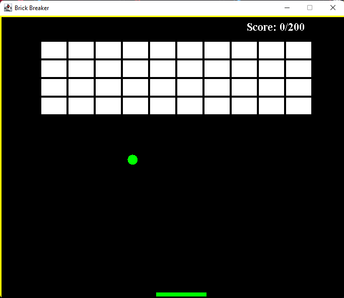

# Brick-Breaker

BrickBreaker é um jogo simples desenvolvida em Java onde seu objetivo é quebrar todos os blocos existentes. Para alcançar tal objetivo o jogador controla uma raquete para rebater uma bolinha que destroi os blocos ao contato.
 
Os comandos para movimentar a raquete são as setas direita e esquerda do teclado, o jogo termina quando o jogador destruir todos os blocos ou deixar a bolinha cair para baixo.

Trabalho desenvolvido na disciplina de Manutenção De Software pelos Hendrick Sumeck e Messias Junior. 

## Repositório original:
https://github.com/zakaria5729/brick-breaker-game
